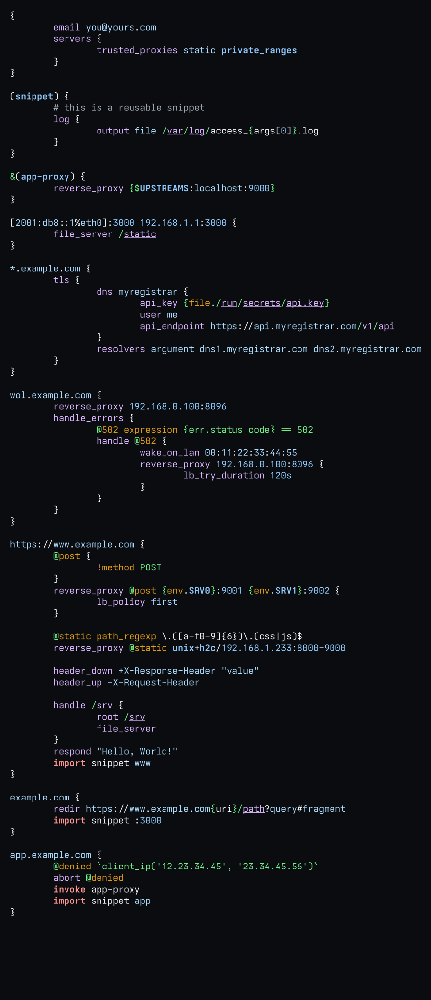

# tree-sitter-caddyfile

A [Caddyfile](https://caddyserver.com) grammar for the [Tree-sitter](https://github.com/tree-sitter/tree-sitter) parser generator.

> [!NOTE]
> This project is not affiliated with or endorsed by the ZeroSSL Project or the maintainers of caddy.

## Contents
- [Features](#features)
    - [Syntax](#base-syntax)
    - [Scheme files](#scheme-files)
    - [Language bindings](#language-bindings)
- [Development](#development)
    - [Testing](#testing)
- [Example](#example)
    - [Syntax highlighting](#syntax-highlighting)
    - [Concrete syntax tree](#concrete-syntax-tree)
- [References](#references)

## Features
### Base syntax
The grammar supports the following Caddyfile language syntax structures:

- **Primitive value types**: `literal_string`, `integer`, `decimal`, `ipv4`
- **Compound value types**: `templated_string`, `duration`, `address`, `ipv6`
- **Global block**
- **Site blocks**
- **Snippet** definitions and references
- **Named routes**
- **Directives** with arguments and/or subdirective blocks
- **Negations** ("not" keyword)
- **Comments**
- **Language injection**
    - Heredocs will highlight according to the label term (eg. "<<HTML" or "<<JSON")[^5]
    - Grave (`\``) quoted cel expressions[^6]
    - `expression` matcher cel expressions[^6]

### Disclaimer
At the time of writing, I believe that this Caddyfile grammar provides greater and more accurate coverage of the modern Caddyfile syntax than the official release. However, I have taken a slightly unconventional approach to writing it. The parser is highly dependant on the custom scanner, so much so that not a single regular expression is used.

This was partially due to the nature of project. The Caddyfile language is highly context dependant and has very little syntactic sugar to help ground the lexer. My approach was to use the parser context to direct the scanner, especially with regards to delineating token boundaries. This proved to be quite effective and, soon, the custom scanner logic grew to dominate the lexing process. Rather than having to contend with the mental strain of reasoning the behaviour of two independent lexers, I decided to translate the remaining declarative logic to the scanner. 

(The other reason is that I really hate writing regex.)

The lexer is written in C11 and is still in early stages of testing. I'm reasonably confident that there are no remaining infinite loops or fatal errors, however I urge caution until a more comprehensive test suite has been written to cover more syntactic combinations.

### To do
- [ ] Fold scheme file
- [ ] !-prefix
- [ ] Tests
- [ ] Benchmarks

### Scheme files 
The following scheme files[^8] are included in [./queries](queries/) to facilitate editor integrations and syntax highlight.

| File | Content |
| ---- | ------- |
| [highlights.scm](queries/highlights.scm)  | syntax highlighting & spell check  |
| [injections.scm](queries/injections.scm)  | language injection[^7]       |
<!-- | [folds.scm](queries/folds.scm)            | code folding                       | -->

### Language bindings
Bindings are available under [./bindings](bindings/) for C, Go, Java, JavaScript, Python, Rust, Swift, and Zig.

## Development

### Testing
> [!WARNING]
> Yet to do

## Example
### Syntax highlighting

### Concrete syntax tree
> [!WARNING]
> Yet to do

## References
[^5]: Language injection requires the associated tree-sitter grammar for that language.
[^6]: tree-sitter-cel
[^7]: [tree-sitter: Language injection](https://tree-sitter.github.io/tree-sitter/3-syntax-highlighting.html#language-injection)
[^8]: [tree-sitter: Query syntax](https://tree-sitter.github.io/tree-sitter/using-parsers/queries/1-syntax.html)
