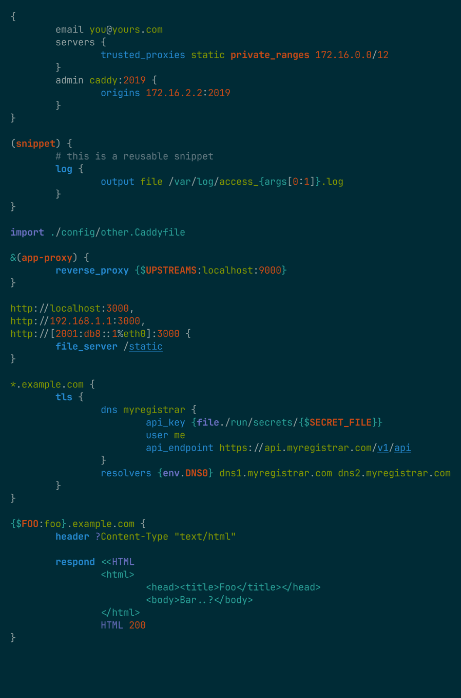
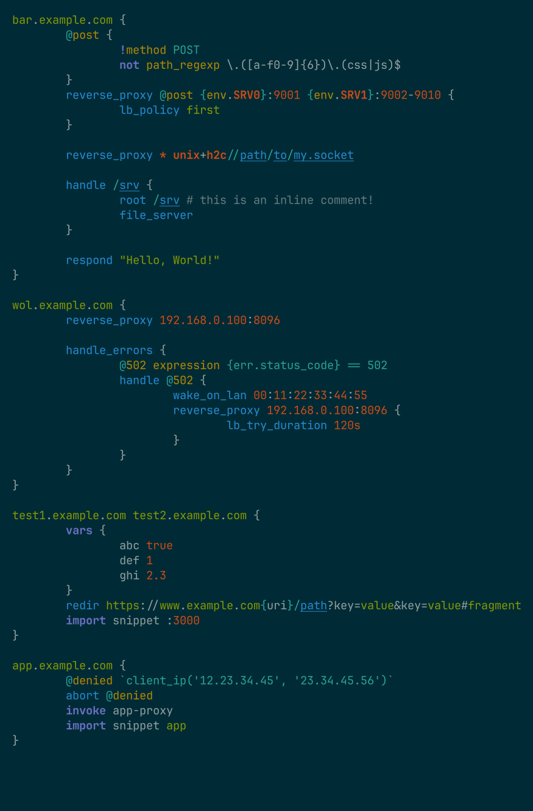

# tree-sitter-caddyfile

An alternative [Caddyfile](https://caddyserver.com) grammar for the [Tree-sitter](https://github.com/tree-sitter/tree-sitter) parser generator.

The grammar places greater emphasis on identifying syntactic boundaries and preserving the smaller nested elements that make up the language. The aim is to provide a more permissive parser with deterministic boundaries and a granular syntax tree, with the hope that this approach will be better suited to editor integrations and language tooling.

> [!NOTE]
> This project is an unofficial alternative grammar and is not affiliated with or endorsed by the maintainers of Caddy Server.
>
> Please see [caddyserver/tree-sitter-caddyfile](https://github.com/caddyserver/tree-sitter-caddyfile) if you are searching for the official grammar maintained by caddyserver.

## Links
- [Documentation](./docs/usage.md)
- [Playground](https://swonky.github.io/tree-sitter-caddyfile)
- [Third party notices](./NOTICE.md)

## Features

### Hierarchical syntax

Syntactic hierarchy is preserved as much as possible to minimise structural ambiguity. 

High-level structural boundaries between nodes are tested against the official Caddyfile reference parser[^1].

Higher-order structures include:

- **Global options**
- **Site blocks**
- **Subdirective blocks**
- **Variable blocks**
- **Snippets**
- **Named matchers**
- **Named routes**
- **Arguments**

### Nested semantic tokens

Argument tokens are classified and, where possible, discretised into semantic structures.

- **Primitive value types**: `literal_string`, `integer`, `decimal`, `wildcard` and others.
- **Quoted strings** with correct backslash escaping behaviour.
- **Compound value types**: 
    - Templatable strings with placeholders.
    - Complex header syntax (eg. `+Foo`, `?Bar`).
    - Go-style durations and byte sizes (eg. `30s`, `1h30m`, `2k`, `50MiB`).
    - URI/URL and network addresses.
        - Full URL decomposition (eg. `[scheme]://[user]@[host]:[port]/[path]?[key]=[value]#fragment`).
        - Hostnames (eg. domain names, IPv4/6 addresses).
        - UNIX sockets with file permissions (`unix://path/to/file|0755`).
        - CIDR ranges.
    - MAC addresses.
    - POSIX and Windows-style pathnames
- **Placeholders**: 
    - Environment variables with default values (eg. `{$FOO:bar}`).
    - Placeholders with namespacing and module-specific highlighting.
    - Nested placeholders (eg. `{file./path/to/{$FILENAME}}`)
    - Go-style index and slice expressions (eg. `args[0]`, `args[0:]`, `args[0:5]`).
    - `{block}` and `{blocks.*}` placeholders.

### Embedded content

The grammar also supports embedded regular expressions[^9], cel expressions[^6], and heredoc content[^5].

- Heredocs will highlight according to the label term (eg. "<<HTML" or "<<JSON")
- Supports \` quoted cel expressions
- `expression` matcher cel expressions[^6]
- `*_regexp` matcher regular expressions[^9]

## Examples

  
  

## References
[^1]: [Caddyfile Go Module](https://pkg.go.dev/github.com/caddyserver/caddy/v2/caddyconfig/caddyfile)
[^5]: Language injection requires the associated tree-sitter grammar for that language.
[^6]: requires [tree-sitter-cel](https://github.com/bufbuild/tree-sitter-cel) or alternative.
[^9]: requires [tree-sitter-regex](https://github.com/tree-sitter/tree-sitter-regex) or alternative.
